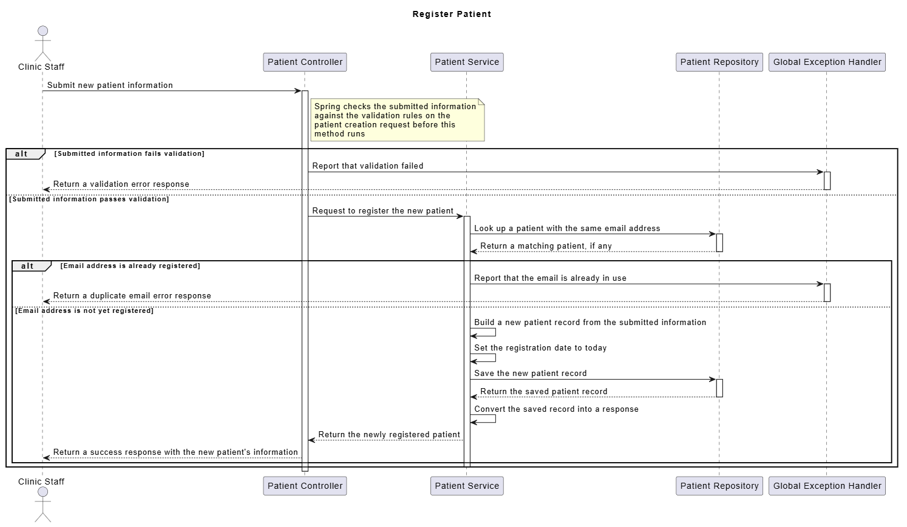

# Clinic Appointment Management System

A Spring Boot REST API for managing clinic patient information.

The current version focuses on **Patient Management** — covering registration, retrieval, updates, deletion, validation, and consistent error handling.

## Features

### Patient Management

- Register a new patient
- Retrieve all patients
- Retrieve a patient by ID
- Update patient information
- Delete a patient

### Validation

Patient data is validated before processing. The system enforces:

- Required fields
- Valid email format
- Valid date of birth
- Date of birth must be in the past
- Required gender
- Valid patient identifier

### Business Rules

- Every patient has a unique system-generated ID.
- Patient email addresses must be unique.
- All required patient information must be provided.
- Invalid patient data is rejected.
- Requests for a nonexistent patient return an appropriate error response.
- The original registration date is preserved when a patient's information is updated.
- A patient cannot be updated with an email that already belongs to another patient.

## API Endpoints

### Create Patient

**POST** `/api/patients`

Example request:

```json
{
  "firstName": "Hamza",
  "lastName": "Galal",
  "email": "hamza@gmail.com",
  "phoneNumber": "01012345678",
  "dateOfBirth": "2005-05-15",
  "gender": "MALE"
}
```

Returns the created patient with a generated ID and registration date.

---

### Get All Patients

**GET** `/api/patients`

Returns a list of all registered patients.

---

### Get Patient by ID

**GET** `/api/patients/{id}`

Example: `/api/patients/1`

Returns the patient with the specified ID.

---

### Update Patient

**PUT** `/api/patients/{id}`

Example: `/api/patients/1`

Updates the patient's information while preserving the original registration date.

---

### Delete Patient

**DELETE** `/api/patients/{id}`

Example: `/api/patients/1`

Deletes the specified patient, if allowed.

## Error Handling

The application uses a centralized exception handler to provide consistent error responses, covering:

- Invalid request data
- Patient not found
- Duplicate email

### HTTP Status Codes

| Status Code | Meaning                             |
|-------------|--------------------------------------|
| `201`       | Patient created successfully        |
| `200`       | Request completed successfully      |
| `204`       | Patient deleted successfully        |
| `400`       | Invalid request or validation error |
| `404`       | Patient not found                   |
| `409`       | Email already exists                |

### Error Response Format

Errors follow a consistent structure:

```json
{
  "timestamp": "2026-09-04T19:30:00",
  "status": 400,
  "error": "Bad Request",
  "message": "Validation Failed",
  "path": "/api/patients"
}
```

Validation errors may also include field-specific error messages.

## Project Architecture

The project follows a layered architecture:

```
Controller → Service → Repository → Database
```

### Controller

Handles HTTP requests and responses. `PatientController` exposes the patient API endpoints.

### Service

Contains the business logic for patient management. `PatientService` is responsible for:

- Creating patients
- Retrieving patients
- Updating patients
- Deleting patients
- Checking for duplicate emails
- Converting entities to response DTOs

### Repository

`PatientRepository` communicates with the database through Spring Data JPA, providing:

- Save
- Find all
- Find by ID
- Find by email
- Existence checks
- Delete

### Model

`Patient` represents the patient entity stored in the database, including:

- ID
- First name
- Last name
- Email
- Phone number
- Date of birth
- Gender
- Registration date

### DTOs

The project uses separate request and response DTOs to avoid exposing the entity directly as the request model:

```
DTO
├── Request
│   ├── PatientCreateRequest
│   └── PatientUpdateRequest
└── Response
    ├── PatientResponse
    └── ErrorResponse
```

### Exception Handling

Custom exceptions:

- `PatientNotFoundException`
- `DuplicateEmailException`

`GlobalExceptionHandler` handles these exceptions along with validation errors.

## Project Structure

```
src
└── main
    └── java
        └── com.ClinicSystem.ClinicAppointmentSystem
            ├── Controller
            │   └── PatientController.java
            ├── Service
            │   └── PatientService.java
            ├── Repository
            │   └── PatientRepository.java
            ├── Model
            │   ├── Patient.java
            │   └── Enums
            │       └── Gender.java
            ├── DTO
            │   ├── Request
            │   │   ├── PatientCreateRequest.java
            │   │   └── PatientUpdateRequest.java
            │   └── Response
            │       ├── PatientResponse.java
            │       └── ErrorResponse.java
            └── Exception
                ├── PatientNotFoundException.java
                ├── DuplicateEmailException.java
                └── GlobalExceptionHandler.java
```

## Technologies

- Java
- Spring Boot
- Spring Web
- Spring Data JPA
- Jakarta Validation
- H2 Database
- Lombok
- Maven
- Postman

## API Testing

The API can be tested using Postman. Core patient requests:

```
POST   /api/patients
GET    /api/patients
GET    /api/patients/{id}
PUT    /api/patients/{id}
DELETE /api/patients/{id}
```

Error scenarios to test:

- Duplicate email
- Invalid email
- Missing required fields
- Future date of birth
- Nonexistent patient ID
- Duplicate email during update
- Invalid update data

## Diagrams

The project includes the following UML diagrams:

### Use Case Diagram

### Class Diagram


### Register Patient Sequence Diagram


These diagrams describe the patient management requirements and the resulting application structure.

## Running the Application

### Prerequisites

- Java JDK
- Maven
- IntelliJ IDEA or another Java IDE

### Start the Application

Run the Spring Boot application from your IDE or via Maven. The API will be available at:

```
http://localhost:8080
```

Patient endpoints are available under:

```
http://localhost:8080/api/patients
```

## Current Scope

The current implementation focuses on **Patient Management**, providing a foundation for the clinic system through a layered Spring Boot architecture with validation, database persistence, DTOs, and centralized error handling.